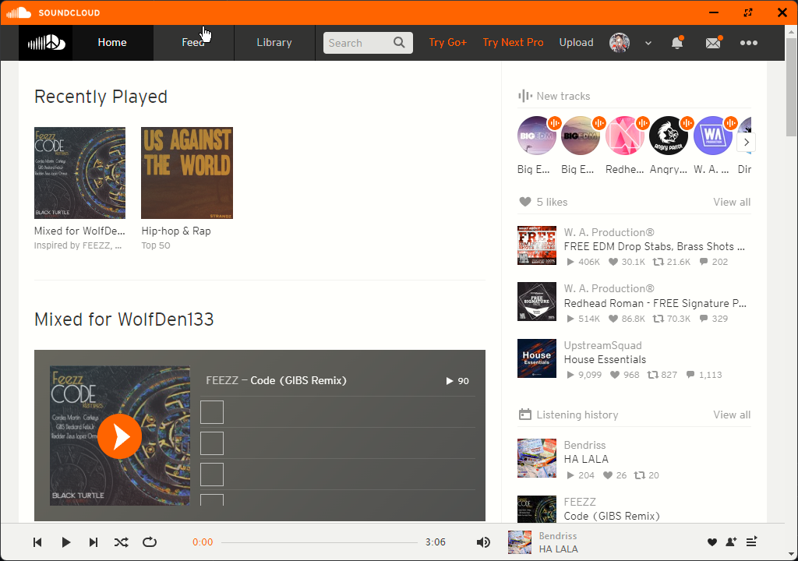

# SoundCloudDesktop
A simple electonjs app to allow the access of soundcloud right on your desktop.



# Info

It does just that! Soundcloud right at your finger tips!

**Author**: WolfDen133
**Version**: `1.1`

# Cloning and building

> ## To clone the repo 
> ``` git clone https://github.com/wolfden133/soundclouddesktop.git ```

> # Then navigated into the cloned directory
> `cd SoundCloudDesktop`


> ## Then install dependancys
> `npm install`


> ## To build the project
> `npm run make`

And your done! 
The application files should be located `SoundCloudDesktop\out\soundcloud-win32-x64` folder

# Installer 

The installer can be found [here]()
